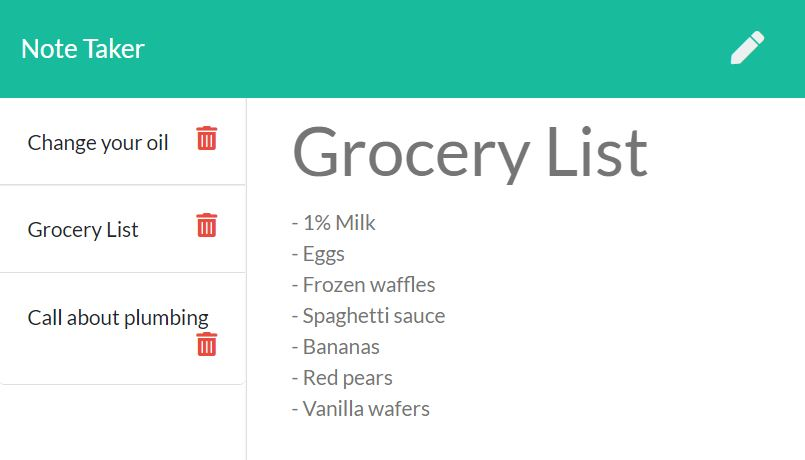

# NodeTaker

Keep track of your notes!

## Table of Contents
* [About](#about)
* [Credits](#credits)
* [Installation](#installation)
* [Usage](#usage)
* [License](#license)

## About
This app will use node.js and express to facilitate saving, viewing and deleting notes in JSON. It demonstrates the basics of routing in node.

## Credits
Project created by @Radergan. 

## Installation
To install dependencies: npm i
To run the app: node server.js

## Usage 
View the app live at http://node-taker.herokuapp.com/ 